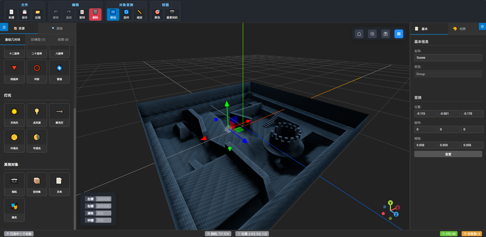

# 3D 场景编辑器 (Three Editor by AI)

一个基于 Vue 3 + Three.js 的现代化3D场景编辑器，支持三维模型的拖放、调整和属性配置。
本工程完全使用AI自行编写代码。

## 🎨 截图


## ✅ 功能体系
- 3D场景渲染和管理
- 多种基础几何体创建
- 完整的对象变换系统（移动、旋转、缩放）
- 撤销重做历史记录
- 3D模型和纹理加载（GLTF、OBJ、FBX等格式）
- 拖拽上传和资源管理
- 相机控制和预设视角
- 材质编辑和属性调整（支持多种材质类型选择与参数动态配置）
- 场景序列化和导入导出

## 🚀 技术栈

- **前端框架**: Vue 3 + Vite
- **3D引擎**: Three.js
- **构建工具**: Vite
- **网络请求**: Fetch API
- **工具库**: 
  - Element Plus - 主流UI组件库
  - Lodash - 实用工具函数库
  - Day.js - 轻量级日期时间库
  - three-viewport-gizmo - 立方体视角控件库

## 📁 项目结构

```
three-editor-by-ai/
├── public/                     # 静态资源
│   └── vite.svg
├── src/
│   ├── assets/                 # 静态资源 (3D模型、纹理等)
│   │   └── vue.svg
│   ├── components/             # Vue 组件
│   │   ├── editor/            # 编辑器 UI 组件
│   │   │   ├── PropertyPanel.vue    # 属性面板
│   │   │   ├── ScenePropertyPanel.vue    # 场景属性面板
│   │   │   ├── ObjectPropertyPanel.vue    # 对象基本属性面板
│   │   │   ├── MaterialPropertyPanel.vue    # 材质编辑面板（已使用element-plus重构UI组件）
│   │   │   ├── TextureSelectDialog.vue # 纹理选择对话框
│   │   │   ├── Toolbar.vue          # 工具栏
│   │   │   ├── EditorFooter.vue     # 编辑器底部状态栏
│   │   │   ├── AssetBrowser.vue     # 资源浏览器
│   │   │   ├── ResourcePanel.vue    # 资源面板
│   │   │   └── Inspector.vue        # 对象检查器
│   │   ├── scene/             # 3D 场景组件
│   │   │   ├── SceneViewer.vue      # 主场景视图
│   │   │   ├── InteractionHints.vue     # 操作提示组件
│   │   │   ├── ViewportControls.vue     # 视图控制面板组件
│   │   │   ├── CubeViewportControls.vue # 立方体视角控件
│   │   │   ├── ObjectGizmo.vue      # 对象操作控制器
│   ├── composables/           # Vue Composition API 可组合函数
│   │   ├── useScene.js        # 场景管理
│   │   ├── useObjectSelection.js  # 对象选择
│   │   ├── useTransform.js    # 变换操作
│   │   └── useAssets.js       # 资源管理
│   ├── core/                  # 核心 Three.js 逻辑
│   │   ├── SceneManager.js    # 场景管理器
│   │   ├── ObjectManager.js   # 对象管理器
│   │   ├── InputManager.js    # 输入处理
│   │   └── AssetLoader.js     # 资源加载器
│   ├── api/                  # API 接口
│   │   ├── *.api.js            # 各种模块API接口
│   ├── utils/                 # 工具函数
│   │   ├── mathUtils.js      # 数学工具
│   │   ├── geometryUtils.js  # 几何工具
│   │   └── fileUtils.js      # 文件处理工具
│   ├── App.vue               # 根组件（仅负责引入Editor.vue）
│   ├── Editor.vue            # 主编辑器组件（包含全部业务与UI）
│   ├── main.js               # 应用入口
│   └── style.css             # 全局样式
├── .gitignore                # Git 忽略文件
├── index.html                # HTML 模板
├── package.json              # 项目配置
├── package-lock.json         # 依赖锁定
├── vite.config.js            # Vite 配置
└── README.md                 # 项目说明
```

**注意：**
- vite.config.js中，配置vite-plugin-static-copy，把几个js库的复制到目标路径：
  - 如需加载Draco压缩的glTF模型，请将node_modules/three/examples/jsm/libs/draco/目录中的文件复制到 /draco/ 目录下。
  - 如需加载KTX2纹理，请将node_modules/three/examples/jsm/libs/basis目录中的文件放入 /basis/ 目录下。
  - 如需加载Meshopt压缩的glTF模型，请将node_modules/three/examples/jsm/libs/meshopt_decoder.module.js文件放入 public/meshopt/ 目录下。

## 🎯 主要功能

- **3D场景渲染**: 基于 Three.js 的高性能 3D 渲染，支持灯光、相机helper自动可视化
- **几何体创建**: 支持多种基础和扩展几何体创建
  - 基础几何体: 立方体、球体、圆柱体、平面、圆锥体、圆环体
  - 扩展几何体: 十二面体、二十面体、八面体、四面体、环形、管道
  - 灯光对象: 方向光、点光源、聚光灯、环境光、半球光
  - 其他对象: 相机、空对象、文本、精灵
- **模型管理**: 支持多种 3D 模型格式的导入和管理
- **交互操作**: 
  - 资源浏览器中直接添加几何体
  - 实时变换操作 (位移、旋转、缩放)
  - 单对象选择和编辑
  - 支持相机控制模式切换：OrbitControls（鼠标）与FlyControls（键盘飞行模式），可在操作提示区勾选“键盘控制”启停
- **属性编辑**: 实时修改模型的材质、几何体等属性
- **场景管理**: 完整的场景层级管理和序列化
- **资源浏览**: 内置资源管理器，支持模型预览和几何体创建
- **后处理机制**: 
  - 集成了Three.js EffectComposer后处理框架，支持多种后处理效果链路（如Bloom、FXAA等）。
  - 提供统一API，可动态添加、移除、调整各类Pass。
  - 主要API：
    - `scene.sceneManager.addPass(pass, index)`：添加指定Pass到后处理链（可指定插入顺序）。
    - `scene.sceneManager.removePass(pass)`：移除指定Pass。
    - `scene.sceneManager.setPassParams(pass, params)`：批量修改Pass参数。
  - 默认已集成RenderPass，业务层可通过`scene.sceneManager.addPass(...)`等方法灵活扩展后处理效果。

## 🏗️ 架构设计

### 组件层次

1. **UI 层** (`components/editor/`): 负责用户界面和交互
2. **主编辑器组件** (`Editor.vue`): 负责所有业务逻辑和UI的集成
3. **3D 渲染层** (`components/scene/`): 处理 3D 场景渲染和显示
4. **逻辑层** (`composables/`, `core/`): 业务逻辑和状态管理
5. **API层** (`api/`): 数据请求和外部接口
6. **工具层** (`utils/`): 通用工具函数

### 技术特点

- **响应式状态**: 使用 Vue 3 Composition API 管理应用状态
- **模块化设计**: 清晰的代码组织和职责分离
- **类型安全**: 良好的代码结构支持 TypeScript 迁移
- **性能优化**: 合理的组件懒加载和渲染优化

## 📋 开发规范

- 遵循 Vue 3 组合式 API 最佳实践
- 使用 ES6+ 语法特性
- 组件命名采用 PascalCase
- 文件和目录命名采用 camelCase
- Git 提交信息格式: `feat: 功能描述`
- 【重要】SceneViewer.vue中TransformControls拖拽时会自动禁用OrbitControls，避免拖拽时镜头跟随问题。若遇到该问题，请优先排查controls.enabled赋值冲突（如飞行控制切换、其他组件逻辑），并参考SceneViewer.vue相关注释。


## 💯 AI
- 本工程完全使用AI自行编写代码（人工编写代码目前少于10行）；
- 开发环境：VSCode + Cline + GitHub Copilot + Claude 4 / GPT-4.1
- 使用Claude 4搭建本工程的主体框架，但由于GitHub Copilot Pro版2天内就消耗完（300 Premium requests），后转向使用GPT-4.1实现各项功能。
- .clinerules目录：存储AI规则
- .clinetask目录：存储历史对话
