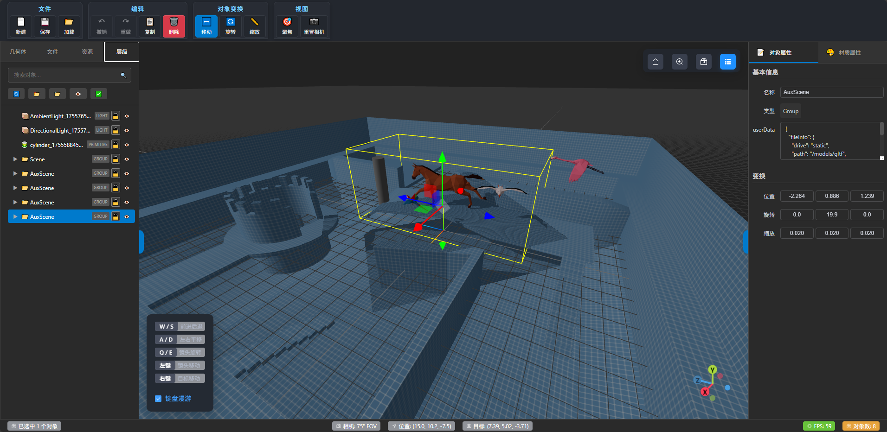

# 3D 场景编辑器 (Three Editor by AI)

一个基于 Vue 3 + Three.js 的现代化3D场景编辑器，支持三维模型的拖放、调整和属性配置。
本工程完全使用AI自行编写代码。

## 🎨 截图


## ✅ 主要功能

- 3D场景渲染和管理
- 多种基础与扩展几何体创建（立方体、球体、圆柱体、平面、圆锥体、圆环体、十二面体、二十面体、八面体、四面体、环形、管道等）
- 完整的对象变换系统（移动、旋转、缩放）、撤销重做历史记录
- 多格式3D模型和纹理加载与管理（GLTF、OBJ、FBX等）
- 拖拽上传、资源管理与资源浏览（支持模型预览和几何体创建）
- 相机控制与预设视角（OrbitControls、FlyControls切换）
- 材质编辑和属性调整（多种材质类型与参数动态配置）
- 场景序列化、导入导出与完整层级管理
- 单对象选择和编辑
- 底部状态栏显示当前视点（相机旋转）
- 虚拟文件系统，对接后端文件库
- 文件面板拖拽模型文件到场景直接加载
- 支持从虚拟文件系统面板拖拽模型文件到场景直接加载
- 拖拽添加对象时，自动放置到当前视点位置
- 后处理机制（集成Three.js EffectComposer，支持Bloom、FXAA等多种后处理效果链路，统一API动态管理Pass）

## 🚀 技术栈

- **前端框架**: Vue 3 + Vite
- **3D引擎**: Three.js
- **构建工具**: Vite
- **网络请求**: Fetch API
- **工具库**: 
  - Element Plus - 主流UI组件库
  - Lodash - 实用工具函数库
  - Day.js - 轻量级日期时间库
  - three-viewport-gizmo - 立方体视角控件库

## 📁 项目结构

```
three-editor-by-ai/
├── public/                   # 存放无需构建的静态资源
│   ├── images/               # 图片资源目录
│   ├── vfs/                  # 静态资源目录（虚拟文件系统，.folder.json文件用于描述目录和文件信息）
├── src/
│   ├── components/                           # Vue 组件
│   │   ├── editor/                           # 编辑器 UI 组件
│   │   │   ├── PropertyPanel.vue             # 属性面板
│   │   │   ├── ScenePropertyPanel.vue        # 场景属性面板
│   │   │   ├── ObjectPropertyPanel.vue       # 对象基本属性面板
│   │   │   ├── MaterialPropertyPanel.vue     # 材质编辑面板
│   │   │   ├── Toolbar.vue                   # 工具栏
│   │   │   ├── EditorFooter.vue              # 编辑器底部状态栏
│   │   │   ├── AssetBrowser.vue              # 资源浏览器
│   │   │   ├── PrimitiveBrowser.vue          # 基础几何体与灯光浏览组件
│   │   │   ├── ResourcePanel.vue             # 资源面板
│   │   │   ├── VfsFilePanel.vue              # 虚拟文件系统面板
│   │   │   └── Inspector.vue                 # 对象检查器
│   │   ├── dialog/                           # 各类对话框组件
│   │   │   └── TextureSelectDialog.vue       # 纹理选择对话框
│   │   ├── scene/                            # 3D 场景组件
│   │   │   ├── SceneViewer.vue               # 主场景视图，支持拖拽添加对象到当前视点位置
│   │   │   ├── InteractionHints.vue          # 操作提示组件
│   │   │   ├── ViewportControls.vue          # 视图控制面板组件
│   │   │   ├── CubeViewportControls.vue      # 立方体视角控件
│   ├── composables/           # Vue Composition API 可组合函数
│   │   ├── useScene.js        # 场景管理
│   │   ├── useObjectSelection.js  # 对象选择
│   │   ├── useTransform.js    # 变换操作
│   │   └── useAssets.js       # 资源管理，包含模型/纹理等资源的加载、缓存与去重机制
│   ├── core/                  # 核心 Three.js 逻辑
│   │   ├── SceneManager.js    # 场景管理器
│   │   ├── ObjectManager.js   # 对象管理器
│   │   ├── InputManager.js    # 输入处理
│   │   └── AssetLoader.js     # 资源加载器
│   ├── services/              # 服务接口
│   │   ├── static-drive-api.js # 静态文件系统封装
│   │   ├── vfs-service.js    # 虚拟文件系统服务，用于读写文件
│   ├── constants/            # 常量与预定义数据
│   │   └── PRIMITIVES.json      # 预定义几何体与灯光类型数据
│   ├── utils/                # 工具函数
│   │   ├── mathUtils.js      # 数学工具
│   │   ├── geometryUtils.js  # 几何工具
│   │   └── fileUtils.js      # 文件处理工具
│   ├── constants/
│   │   └── PRIMITIVES.json      # 预定义几何体与灯光类型数据
│   ├── App.vue               # 根组件（仅负责引入Editor.vue）
│   ├── Editor.vue            # 主编辑器组件（包含全部业务与UI）
│   ├── main.js               # 应用入口
│   └── style.css             # 全局样式
├── .gitignore                # Git 忽略文件
├── index.html                # HTML 模板
├── package.json              # 项目配置
├── package-lock.json         # 依赖锁定
├── vite.config.js            # Vite 配置
├── generate-vfs.js           # 脚本：生成虚拟文件系统的元数据，用于编辑器的文件浏览器
└── README.md                 # 项目说明
```

## 🏗️ 架构设计

### 组件层次

1. **主编辑器组件** (`Editor.vue`): 负责所有业务逻辑和UI的集成
2. **UI 层** (`components/editor/`, `components/dialog/`): 负责用户界面和交互
3. **3D 渲染层** (`components/scene/`): 处理 3D 场景渲染和显示
4. **逻辑层** (`composables/`, `core/`): 业务逻辑和状态管理
5. **服务层** (`services/`): 数据请求和外部接口
6. **工具层** (`utils/`): 通用工具函数

### 技术特点

- **响应式状态**: 使用 Vue 3 Composition API 管理应用状态
- **模块化设计**: 清晰的代码组织和职责分离
- **类型安全**: 良好的代码结构支持 TypeScript 迁移
- **性能优化**: 合理的组件懒加载和渲染优化

## 📋 开发规范

- 遵循 Vue 3 组合式 API 最佳实践
- 使用 ES6+ 语法特性
- 组件命名采用 PascalCase
- 文件和目录命名采用 camelCase
- Git 提交信息格式: `feat: 功能描述`

## 重要逻辑

- vite.config.js中，配置vite-plugin-static-copy，把几个js库的复制到目标路径：
  - 如需加载Draco压缩的glTF模型，请将node_modules/three/examples/jsm/libs/draco/目录中的文件复制到 /draco/ 目录下。
  - 如需加载KTX2纹理，请将node_modules/three/examples/jsm/libs/basis目录中的文件放入 /basis/ 目录下。
  - 如需加载Meshopt压缩的glTF模型，请将node_modules/three/examples/jsm/libs/meshopt_decoder.module.js文件放入 public/meshopt/ 目录下。
- TransformControls相关功能已迁移至SceneManager.js统一管理，SceneViewer.vue仅负责初始化调用。
- SceneManager.js中，TransformControls拖拽时会自动禁用OrbitControls，避免拖拽时镜头跟随问题。
- ObjectManager.js中，变换后分发object-transform-updated事件。
- useScene.js中，聚焦对象时计算中心点并设置OrbitControls target。
- useObjectSelection.js中， 内部定义了 `selectionStore`（响应式对象）：
  - 用于存储选中对象的临时材质信息（如 originalMaterial、selectionMaterial、hoverMaterial），key 为对象 id。
  - 所有高亮、悬停等临时材质状态均集中存储于 selectionStore，不再污染 three.js 对象的 userData 字段，便于维护和调试。
  - selectionStore 生命周期与 useObjectSelection 组合式函数一致，自动随页面刷新或状态重置而清空。
- useAssets.js 中：
  - 资源加载函数（如 loadModel、loadTexture）已实现缓存机制：若 assetLibrary 中已存在同名且大小一致的资源，则直接返回缓存，避免重复加载和内存浪费。
- 所有资源（基础几何体、模型、资源）添加方式已统一为拖拽，点击添加功能已移除

## 💯 AI

- 本工程完全使用AI自行编写代码（人工编写代码目前少于10行）；
- 开发环境：VSCode + Cline + GitHub Copilot + Claude 4 / GPT-4.1
- 使用Claude 4搭建本工程的主体框架，但由于GitHub Copilot Pro版2天内就消耗完（300 Premium requests），后转向使用GPT-4.1实现各项功能。
- .clinerules目录：存储AI规则
- .clinetask目录：存储历史对话
