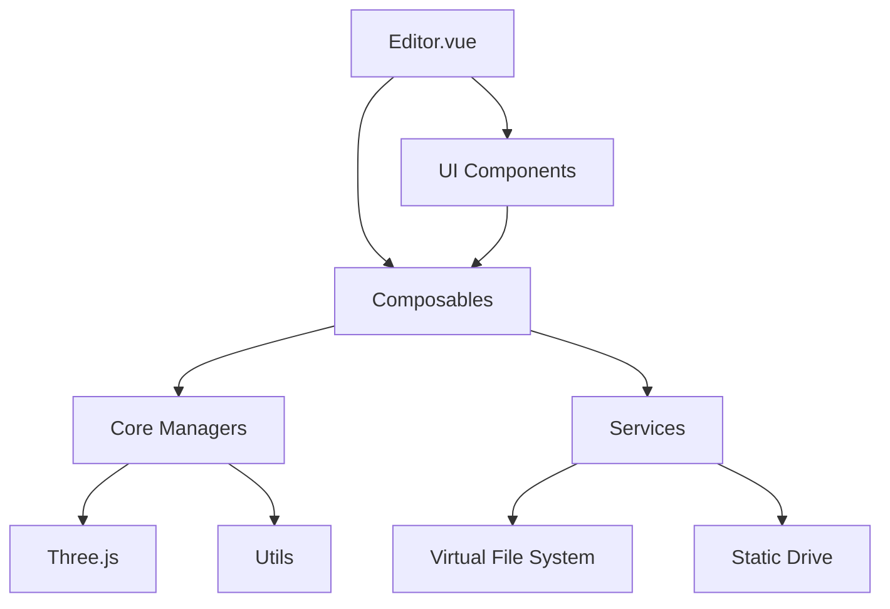

# Three Editor by AI - 项目目录结构

**生成日期**: 2026-04-07  
**项目版本**: 0.1.0

---

## 根目录结构

```
three-editor-by-ai/
├── src/                          # 源代码目录
├── public/                       # 静态资源目录
├── script/                       # 后端脚本和服务
├── specs/                        # 规范文档目录（本目录）
├── .specify/                     # Spec Kit 配置和模板
├── .opencode/                    # OpenCode 配置
├── .vscode/                      # VSCode 编辑器配置
├── index.html                    # HTML 入口文件
├── package.json                  # 项目配置文件
├── vite.config.js                # Vite 构建配置
├── README.md                     # 项目说明文档
└── LICENSE                       # 开源许可证
```

---

## 源代码目录 (src/)

### 核心文件

| 文件 | 说明 |
|------|------|
| `main.js` | 应用入口文件，初始化 Vue 应用 |
| `main-func.js` | 应用入口功能函数 |
| `App.vue` | 根组件（仅负责引入 Editor.vue） |
| `Editor.vue` | 主编辑器组件（包含全部业务与 UI） |
| `style.scss` | 全局样式文件 |

### 组件目录 (components/)

#### 编辑器 UI 组件 (editor/)

| 组件 | 说明 |
|------|------|
| `AssetBrowser.vue` | 资源浏览器 |
| `EditorFooter.vue` | 编辑器底部状态栏 |
| `Inspector.vue` | 对象检查器 |
| `MultiSelectPanel.vue` | 多对象批量操作面板 |
| `ObjectItem.vue` | 对象列表项组件 |
| `PrimitiveBrowser.vue` | 基础几何体与灯光浏览组件 |
| `PropertyPanel.vue` | 属性面板 |
| `ResourcePanel.vue` | 资源面板 |
| `Toolbar.vue` | 工具栏 |
| `VfsFileBrowser.vue` | 虚拟文件系统面板 |

#### 属性编辑组件 (property/)

| 组件 | 说明 |
|------|------|
| `AnimationPropertyPane.vue` | 动画属性面板（动画选择与播放） |
| `BasePropertyPane.vue` | 对象基础属性编辑面板 |
| `FileUrlPropertyItem.vue` | 文件 URL 属性项 |
| `MaterialPropertyPane.vue` | 材质编辑面板 |
| `MaterialPropertyPaneAdv.vue` | 高级材质编辑面板 |
| `MaterialSelectPropertyItem.vue` | 材质选择属性项 |
| `PrimitivePropertyPane-*.vue` | 各种几何体的专属属性编辑面板（box, circle, cone, cylinder 等 15 种） |
| `LightPropertyPane-*.vue` | 各种灯光的专属属性面板（6 种光源类型） |
| `ScenePropertyPane.vue` | 场景属性编辑面板 |
| `SceneUserDataPropertyPane.vue` | 场景的 userData 属性编辑面板 |
| `TexturePropertyItem.vue` | 纹理属性项 |
| `TexturePropertyPane.vue` | 纹理编辑面板 |
| `TransformPropertyPane.vue` | 变换属性面板（位置、旋转、缩放） |
| `UserDataPropertyPane.vue` | userData 属性编辑面板 |
| `PropertyPane.scss` | 属性面板样式 |

#### 对话框组件 (dialog/)

| 组件 | 说明 |
|------|------|
| `EditorConfigDialog.vue` | 编辑器配置对话框 |
| `UserDataPopup.vue` | UserData 编辑弹出框 |
| `VfsFileChooserDialog.vue` | 虚拟文件系统文件选择对话框 |
| `VfsFileSaverDialog.vue` | 文件保存对话框（基于虚拟文件系统） |
| `VfsFolderChooserDialog.vue` | 目录选择对话框（基于虚拟文件系统） |
| `VfsMaterialChooserDialog.vue` | 材质选择对话框（基于虚拟文件系统） |

#### 3D 场景组件 (scene/)

| 组件 | 说明 |
|------|------|
| `CubeViewportControls.vue` | 立方体视角控件 |
| `InteractionHints.vue` | 操作提示组件，支持切换控制器 |
| `SceneViewer.vue` | 主场景视图，支持拖拽添加对象到当前视点位置 |
| `SceneViewer.scss` | 场景视图样式 |
| `StatHints.vue` | 性能监控面板 |
| `ViewportControls.vue` | 视图控制面板组件 |

### 组合式函数目录 (composables/)

| 文件 | 说明 |
|------|------|
| `useAssetsManager.js` | 资源管理组合式函数（17,992 字节） |
| `useAxesLockState.js` | Y 轴锁定状态组合式函数 |
| `useCameraPosState.js` | 相机状态组合式函数 |
| `useControls.js` | 控制器状态组合式函数 |
| `useEditorConfig.js` | 编辑器配置组合式函数 |
| `useEventBus.js` | 事件总线组合式函数 |
| `useHelpers.js` | 辅助对象组合式函数 |
| `useInputManager.js` | 输入管理组合式函数 |
| `useInspectorHandler.js` | 检查器处理组合式函数 |
| `useMaterial.js` | 材质管理组合式函数（14,095 字节） |
| `useNavigationsState.js` | 漫游列表状态组合式函数 |
| `useObjectManager.js` | 对象管理组合式函数 |
| `useObjectSelection.js` | 对象选择与变换控制管理（17,910 字节） |
| `useStats.js` | 场景统计信息组合式函数 |
| `useThreeViewer.js` | Three.js 视图管理组合式函数（13,190 字节） |
| `useTransform.js` | 变换操作组合式函数（15,997 字节） |

### 核心逻辑目录 (core/)

| 文件 | 说明 | 大小 |
|------|------|------|
| `AssetLoader.js` | 资源加载器 | 12,969 字节 |
| `InputManager.js` | 输入管理器 | 9,927 字节 |
| `ObjectManager.js` | 对象管理器 | 23,964 字节 |
| `ThreeViewer.js` | 场景管理器 | 25,517 字节 |

### 服务目录 (services/)

| 文件 | 说明 |
|------|------|
| `static-drive-api.js` | 静态文件系统封装 |
| `vfs-server-api.js` | 虚拟文件系统封装 |
| `vfs-service.js` | 虚拟文件系统服务 |

### 控制器目录 (controls/)

| 文件 | 说明 |
|------|------|
| `FlyControls.js` | 飞行控制器，支持基于键盘、鼠标的三维飞行 |

### 工具函数目录 (utils/)

| 文件 | 说明 |
|------|------|
| `mathUtils.js` | 数学工具 |
| `geometryUtils.js` | 几何工具 |
| `fileUtils.js` | 文件处理工具 |

### 常量目录 (constants/)

| 文件 | 说明 |
|------|------|
| `PRIMITIVES.json` | 预定义几何体与灯光类型数据 |
| `DEFAULT_CAMERA_POS.json` | 预定义相机位置数据 |

---

## 静态资源目录 (public/)

### 图片资源 (images/)

| 文件 | 说明 |
|------|------|
| `screenshot01.png` | 编辑器截图 |

### 虚拟文件系统 (vfs/)

| 文件/目录 | 说明 |
|-----------|------|
| `.folder.json` | 虚拟文件系统根目录元数据 |
| `.all.json` | 虚拟文件系统完整索引 |
| `vfs.json` | 虚拟文件系统配置 |
| `zoo.json` | 虚拟文件系统动物园配置 |
| `models/` | 3D 模型资源目录 |
| `models/gltf/` | GLTF/GLB 格式模型（5 个示例模型） |
| `models/fbx/` | FBX 格式模型（1 个示例模型） |
| `models/obj/` | OBJ 格式模型（1 个示例模型） |
| `textures/` | 纹理资源目录 |
| `textures/brick/` | 砖块纹理（漫反射、法线、粗糙度） |
| `textures/hardwood2/` | 硬木纹理（漫反射、法线、粗糙度） |

---

## 后端脚本目录 (script/)

| 文件 | 说明 |
|------|------|
| `vfs-server.js` | 虚拟文件系统后端服务（12,427 字节） |
| `generate-vfs.js` | 生成虚拟文件系统元数据脚本 |
| `vfs-server.json` | 虚拟文件系统服务配置 |
| `package.json` | 脚本子项目配置 |
| `package-lock.json` | 依赖锁定文件 |

---

## 配置目录

### Spec Kit 配置 (.specify/)

```
.specify/
├── memory/
│   └── constitution.md          # 项目宪法原则（待填充）
├── scripts/                      # Spec Kit 脚本
├── templates/                    # Spec Kit 模板
│   ├── spec-template.md          # 规格文档模板
│   ├── plan-template.md          # 技术方案模板
│   ├── tasks-template.md         # 任务清单模板
│   ├── checklist-template.md     # 检查清单模板
│   ├── constitution-template.md  # 宪法模板
│   └── agent-file-template.md    # Agent 文件模板
├── init-options.json             # 初始化配置
└── integration.json              # 集成配置
```

### OpenCode 配置 (.opencode/)

```
.opencode/command/
├── speckit.analyze.md
├── speckit.checklist.md
├── speckit.clarify.md
├── speckit.constitution.md
├── speckit.implement.md
├── speckit.plan.md
├── speckit.specify.md
├── speckit.tasks.md
└── speckit.taskstoissues.md
```

### VSCode 配置 (.vscode/)

标准 VSCode 工作区配置

---

## 页面和路由清单

### 页面清单

本项目为**单页面应用 (SPA)**，主要页面：

| 页面 | 组件 | 路由 | 说明 |
|------|------|------|------|
| 主编辑器页 | `Editor.vue` | `/` (根路径) | 唯一的用户界面页面，包含完整的 3D 编辑器功能 |

### 路由配置

**注意**: 本项目未发现显式的路由配置文件（如 vue-router 配置）。应用采用单页面架构，所有功能在 `Editor.vue` 中统一管理。

---

## REST API 清单

### 虚拟文件系统 API

详见 [`API.md`](./API.md) - 完整 API 文档

| API 路径 | Method | 用途 | 入口文件 |
|----------|--------|------|----------|
| `/api/vfs/drives` | GET | 获取所有虚拟驱动器列表 | `vfs-server-api.js` |
| `/api/vfs/files/*` | GET | 读取虚拟文件系统文件 | `vfs-server-api.js` |
| `/api/vfs/folders/*` | GET | 列出目录内容 | `vfs-server-api.js` |
| `/api/static/*` | GET | 访问静态资源 | `static-drive-api.js` |

---

## 代码统计

### 文件类型统计

| 类型 | 数量 | 说明 |
|------|------|------|
| Vue 组件 | 40+ | `.vue` 文件 |
| JavaScript 模块 | 20+ | `.js` 文件 |
| JSON 配置 | 10+ | `.json` 文件 |
| SCSS 样式 | 2 | `.scss` 文件 |
| HTML | 1 | `index.html` |

### 核心模块规模

| 模块 | 代码量 | 复杂度 |
|------|--------|--------|
| ThreeViewer.js | 25,517 字节 | 高 - 场景管理核心 |
| ObjectManager.js | 23,964 字节 | 高 - 对象管理核心 |
| useAssetsManager.js | 17,992 字节 | 高 - 资源管理 |
| useObjectSelection.js | 17,910 字节 | 高 - 选择与变换 |
| useTransform.js | 15,997 字节 | 中 - 变换操作 |
| useMaterial.js | 14,095 字节 | 中 - 材质管理 |
| AssetLoader.js | 12,969 字节 | 中 - 资源加载 |
| InputManager.js | 9,927 字节 | 中 - 输入管理 |

---

## 架构分层

```
┌─────────────────────────────────────────┐
│          UI Layer (Vue Components)      │
│  Editor.vue + components/editor/*       │
├─────────────────────────────────────────┤
│        Logic Layer (Composables)        │
│  use*.* - 业务逻辑和状态管理             │
├─────────────────────────────────────────┤
│        Engine Layer (Core)              │
│  ThreeViewer, ObjectManager, etc.       │
├─────────────────────────────────────────┤
│        Service Layer                    │
│  VFS API, Static Drive API              │
├─────────────────────────────────────────┤
│        Utilities Layer                  │
│  mathUtils, geometryUtils, fileUtils    │
└─────────────────────────────────────────┘
```

---

## 依赖关系图



---

## 关键设计模式

1. **Composition API**: 使用 Vue 3 组合式 API 管理状态和逻辑
2. **事件驱动**: 核心管理器集成 mitt 事件总线，实现模块解耦
3. **响应式状态**: 所有状态使用 Vue 3 响应式系统
4. **模块化设计**: 清晰的职责分离和代码组织
5. **拖拽交互**: 统一的拖拽添加对象机制
6. **序列化设计**: 支持场景完整序列化与反序列化
7. **缓存机制**: 资源加载实现缓存避免重复加载

---

## 后续参考

- 完整 API 文档：[`API.md`](./API.md)
- 技术选型：[`TECH.md`](./TECH.md)
- 架构设计：[`ARCHITECTURE.md`](./ARCHITECTURE.md)
