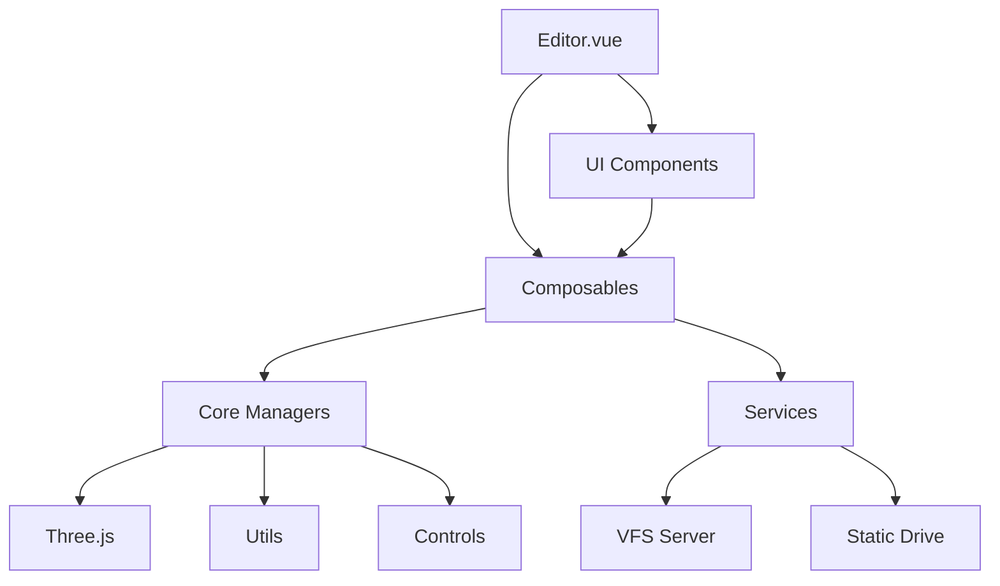

# Three Editor by AI - 项目目录结构

**生成日期**: 2026-04-14  
**项目版本**: 0.1.0

---

## 根目录结构

```
three-editor-by-ai/
├── src/                          # 源代码目录
├── public/                       # 静态资源目录
├── script/                       # 后端脚本和服务
├── specs/                 # 规范文档目录（本目录）
├── index.html                    # HTML 入口文件
├── package.json                  # 项目配置文件
├── vite.config.js                # Vite 构建配置
├── README.md                     # 项目说明文档
└── LICENSE                       # 开源许可证
```

---

## 源代码目录 (src/)

### 核心文件

| 文件 | 说明 |
|------|------|
| `main.js` | 应用入口文件，创建并挂载 Vue 应用实例 |
| `main-func.js` | 应用入口辅助功能函数 |
| `App.vue` | 根组件（仅负责引入 Editor.vue） |
| `Editor.vue` | 主编辑器组件（包含全部业务逻辑与 UI 集成） |
| `style.scss` | 全局样式文件 |

### 组件目录 (components/)

#### 编辑器 UI 组件 (editor/)

| 组件 | 说明 |
|------|------|
| `AssetBrowser.vue` | 资源浏览器面板 |
| `EditorFooter.vue` | 编辑器底部状态栏 |
| `Inspector.vue` | 对象检查器面板 |
| `MultiSelectPanel.vue` | 多对象批量操作面板 |
| `ObjectItem.vue` | 对象列表项组件 |
| `PrimitiveBrowser.vue` | 基础几何体与灯光浏览组件 |
| `PropertyPanel.vue` | 属性面板容器 |
| `ResourcePanel.vue` | 资源面板 |
| `Toolbar.vue` | 顶部工具栏 |
| `VfsFileBrowser.vue` | 虚拟文件系统文件浏览器面板 |

#### 属性编辑组件 (property/)

| 组件 | 说明 |
|------|------|
| `AnimationPropertyPane.vue` | 动画属性面板（动画选择与播放控制） |
| `BasePropertyPane.vue` | 对象基础属性编辑面板 |
| `FileUrlPropertyItem.vue` | 文件 URL 属性项组件 |
| `MaterialPropertyPane.vue` | 材质编辑面板 |
| `MaterialPropertyPaneAdv.vue` | 高级材质编辑面板（整合各子面板） |
| `MaterialPropertyPaneAdv-*.vue` | 高级材质子面板（basic, color, normal, metalness, roughness, emissive, bump, displacement, alpha, transmission, ao, env, light, clearcoat, sheen, specular, thickness 共 17 个） |
| `MaterialSelectPropertyItem.vue` | 材质选择属性项 |
| `PrimitivePropertyPane-*.vue` | 几何体专属属性面板（box, circle, cone, cylinder, dodecahedron, icosahedron, octahedron, plane, ring, sphere, tetrahedron, torus, tube 共 13 种） |
| `LightPropertyPane-*.vue` | 灯光专属属性面板（AmbientLight, DirectionalLight, HemisphereLight, PointLight, RectAreaLight, SpotLight 共 6 种） |
| `ScenePropertyPane.vue` | 场景属性编辑面板 |
| `SceneUserDataPropertyPane.vue` | 场景 userData 属性编辑面板 |
| `TexturePropertyItem.vue` | 纹理属性项组件 |
| `TexturePropertyPane.vue` | 纹理编辑面板 |
| `TransformPropertyPane.vue` | 变换属性面板（位置、旋转、缩放） |
| `UserDataPropertyPane.vue` | userData 属性编辑面板 |
| `PropertyPane.scss` | 属性面板通用样式 |

#### 对话框组件 (dialog/)

| 组件 | 说明 |
|------|------|
| `EditorConfigDialog.vue` | 编辑器配置对话框 |
| `UserDataPopup.vue` | UserData 编辑弹出框 |
| `VfsFileChooserDialog.vue` | 虚拟文件系统文件选择对话框 |
| `VfsFileSaverDialog.vue` | 文件保存对话框（基于虚拟文件系统） |
| `VfsFolderChooserDialog.vue` | 目录选择对话框（基于虚拟文件系统） |
| `VfsMaterialChooserDialog.vue` | 材质选择对话框（基于虚拟文件系统） |

#### 3D 场景组件 (scene/)

| 组件 | 说明 |
|------|------|
| `CubeViewportControls.vue` | 立方体视角控件 |
| `InteractionHints.vue` | 操作提示组件，支持切换控制器 |
| `SceneViewer.vue` | 主场景视图，支持拖拽添加对象到当前视点位置 |
| `SceneViewer.scss` | 场景视图样式 |
| `StatHints.vue` | 性能监控面板 |
| `ViewportControls.vue` | 视图控制面板组件 |

### 组合式函数目录 (composables/)

| 文件 | 说明 | 大小 |
|------|------|------|
| `useAssetsManager.js` | 资源管理组合式函数（含缓存机制） | 17,992 字节 |
| `useAxesLockState.js` | Y 轴锁定状态组合式函数 | 563 字节 |
| `useCameraPosState.js` | 相机位置状态组合式函数 | 4,387 字节 |
| `useControls.js` | 控制器状态组合式函数 | 3,789 字节 |
| `useEditorConfig.js` | 编辑器配置组合式函数 | 3,734 字节 |
| `useEventBus.js` | 事件总线组合式函数（mitt 封装） | 171 字节 |
| `useHelpers.js` | 辅助对象组合式函数 | 1,817 字节 |
| `useInputManager.js` | 输入管理组合式函数 | 257 字节 |
| `useInspectorHandler.js` | 检查器处理组合式函数 | 3,300 字节 |
| `useMaterial.js` | 材质管理组合式函数 | 14,095 字节 |
| `useNavigationsState.js` | 漫游列表状态组合式函数 | 1,558 字节 |
| `useObjectManager.js` | 对象管理组合式函数 | 1,433 字节 |
| `useObjectSelection.js` | 对象选择与变换控制管理（含 TransformControls） | 17,910 字节 |
| `useStats.js` | 场景统计信息组合式函数 | 1,671 字节 |
| `useThreeViewer.js` | Three.js 视图管理组合式函数 | 13,190 字节 |
| `useTransform.js` | 变换操作组合式函数（含撤销/重做） | 15,997 字节 |

### 核心逻辑目录 (core/)

| 文件 | 说明 | 大小 |
|------|------|------|
| `AssetLoader.js` | 资源加载器（支持 GLTF/OBJ/FBX/3DTiles 等格式） | 12,969 字节 |
| `InputManager.js` | 输入管理器（鼠标、键盘事件处理） | 9,927 字节 |
| `ObjectManager.js` | 对象管理器（创建、删除、序列化、查找） | 23,964 字节 |
| `ThreeViewer.js` | 场景管理器（Three.js 场景封装、渲染、后处理） | 25,517 字节 |

### 服务目录 (services/)

| 文件 | 说明 |
|------|------|
| `static-drive-api.js` | 静态文件系统封装（只读，基于 .folder.json 元数据） |
| `vfs-server-api.js` | 虚拟文件系统封装（读写，对接 VFS Server） |
| `vfs-service.js` | 虚拟文件系统服务层 |

### 控制器目录 (controls/)

| 文件 | 说明 | 大小 |
|------|------|------|
| `FlyControls.js` | 飞行控制器（支持键盘 WASD/QE、鼠标三维飞行） | 约 22,000 字节 |

### 工具函数目录 (utils/)

| 文件 | 说明 |
|------|------|
| `mathUtils.js` | 数学工具函数 |
| `geometryUtils.js` | 几何工具函数 |
| `fileUtils.js` | 文件处理工具函数 |

### 常量目录 (constants/)

| 文件 | 说明 |
|------|------|
| `PRIMITIVES.json` | 预定义几何体与灯光类型数据 |
| `DEFAULT_CAMERA_POS.json` | 预定义相机位置数据 |

---

## 静态资源目录 (public/)

### 图片资源 (images/)

| 文件 | 说明 |
|------|------|
| `screenshot01.png` | 编辑器截图（约 1.2 MB） |

### 虚拟文件系统 (vfs/)

| 文件/目录 | 说明 |
|-----------|------|
| `.folder.json` | 虚拟文件系统根目录元数据 |
| `.all.json` | 虚拟文件系统完整索引 |
| `vfs.json` | 虚拟文件系统配置 |
| `zoo.json` | 虚拟文件系统动物园配置 |
| `models/` | 3D 模型资源目录 |
| `models/gltf/` | GLTF/GLB 格式模型（5 个：Flamingo, Horse, Parrot, Stork, collision-world） |
| `models/fbx/` | FBX 格式模型（1 个：nurbs.fbx） |
| `models/obj/` | OBJ 格式模型（1 个：tree.obj） |
| `textures/` | 纹理资源目录 |
| `textures/brick/` | 砖块纹理（漫反射、法线、粗糙度） |
| `textures/hardwood2/` | 硬木纹理（漫反射、法线、粗糙度） |

---

## 后端脚本目录 (script/)

| 文件 | 说明 | 大小 |
|------|------|------|
| `vfs-server.js` | 虚拟文件系统后端服务（Express，默认端口 3001） | 12,427 字节 |
| `generate-vfs.js` | 生成虚拟文件系统元数据脚本 | - |
| `vfs-server.json` | 虚拟文件系统服务配置（drive 映射） | - |
| `package.json` | 脚本子项目依赖配置 | - |
| `package-lock.json` | 依赖锁定文件 | - |

---

## 页面和路由清单

### 页面清单

本项目为**单页面应用 (SPA)**，全部功能集中在单一页面中：

| 页面 | 组件 | 路由 | 说明 |
|------|------|------|------|
| 主编辑器页 | `Editor.vue` | `/` (根路径) | 唯一的用户界面页面，集成 3D 场景渲染、属性编辑、资源管理、虚拟文件系统等全部功能 |

### 路由配置

**注意**: 本项目未使用 vue-router 或任何路由库。应用采用纯 SPA 架构，所有功能在 `Editor.vue` 中通过组件显隐和状态管理实现页面内切换。

---

## REST API 清单

### 虚拟文件系统 API

详见 [`API.md`](./API.md) - 完整 API 文档

| API 路径 | Method | 用途 | 入口文件 |
|----------|--------|------|----------|
| `/api/list/:drive` | GET | 获取虚拟驱动器目录内容 | `vfs-server.js`, `vfs-server-api.js` |
| `/file/:drive/*` | GET | 获取文件内容（二进制/文本） | `vfs-server.js`, `vfs-server-api.js` |
| `/exists/:drive/*` | GET | 检查文件/目录是否存在 | `vfs-server.js`, `vfs-server-api.js` |
| `/save/:drive/*` | POST | 保存文本文件 | `vfs-server.js`, `vfs-server-api.js` |
| `/save-base64/:drive/*` | POST | Base64 数据保存为文件 | `vfs-server.js` |
| `/upload/:drive/*` | POST | 文件上传 | `vfs-server.js` |

### 静态文件系统 API

| API 路径 | Method | 用途 | 入口文件 |
|----------|--------|------|----------|
| `{path}/.folder.json` | GET | 获取目录元数据 | `static-drive-api.js` |
| `{root}/{path}` | GET | 获取文件 URL/内容 | `static-drive-api.js` |
| `{root}/.all.json` | GET | 检查文件是否存在 | `static-drive-api.js` |

---

## 代码统计

### 文件类型统计

| 类型 | 数量 | 说明 |
|------|------|------|
| Vue 组件 | 71 | `.vue` 文件 |
| JavaScript 模块 | 29 | `.js` 文件 |
| JSON 配置 | 2 | `.json` 文件（constants/ 目录） |
| SCSS 样式 | 3 | `.scss` 文件（含组件样式） |
| HTML | 1 | `index.html` |

### 核心模块规模

| 模块 | 代码量 | 复杂度 |
|------|--------|--------|
| ThreeViewer.js | 25,517 字节 | 高 - 场景管理、渲染、后处理核心 |
| ObjectManager.js | 23,964 字节 | 高 - 对象生命周期管理核心 |
| useAssetsManager.js | 17,992 字节 | 高 - 资源加载与缓存管理 |
| useObjectSelection.js | 17,910 字节 | 高 - 对象选择与变换控制 |
| useTransform.js | 15,997 字节 | 中 - 变换操作与撤销/重做 |
| useMaterial.js | 14,095 字节 | 中 - 材质创建与编辑管理 |
| useThreeViewer.js | 13,190 字节 | 中 - Three.js 视图封装 |
| AssetLoader.js | 12,969 字节 | 中 - 多格式资源加载 |
| vfs-server.js | 12,427 字节 | 中 - VFS 后端服务 |
| InputManager.js | 9,927 字节 | 中 - 输入事件管理 |

---

## 架构分层

```
┌─────────────────────────────────────────────────┐
│              UI Layer (Vue Components)           │
│  Editor.vue + components/{editor,property,       │
│    dialog,scene}/                                │
├─────────────────────────────────────────────────┤
│            Logic Layer (Composables)             │
│  use*.* - 业务逻辑、状态管理、事件驱动            │
├─────────────────────────────────────────────────┤
│              Engine Layer (Core)                 │
│  ThreeViewer, ObjectManager,                     │
│  InputManager, AssetLoader                       │
├─────────────────────────────────────────────────┤
│              Service Layer                       │
│  vfs-server-api, static-drive-api, vfs-service   │
├─────────────────────────────────────────────────┤
│              Utilities Layer                     │
│  mathUtils, geometryUtils, fileUtils             │
└─────────────────────────────────────────────────┘
```

---

## 依赖关系图



---

## 关键设计模式

1. **Composition API**: 使用 Vue 3 组合式 API 管理状态和业务逻辑
2. **事件驱动架构**: 核心管理器集成 mitt 事件总线，实现模块间解耦通信
3. **响应式状态管理**: 全部状态使用 Vue 3 响应式系统，自动追踪依赖
4. **模块化职责分离**: 清晰的代码组织，引擎层、逻辑层、UI 层独立
5. **拖拽交互统一机制**: 资源添加统一采用拖拽方式，移除点击添加
6. **序列化与反序列化一致**: 场景完整序列化，userData 与运行时对象分离
7. **资源加载缓存**: AssetLoader 实现缓存机制，避免重复加载相同资源
8. **撤销/重做历史**: Transform 操作支持完整的 undo/redo 栈

---

## 后续参考

- 完整 API 文档：[`API.md`](./API.md)
